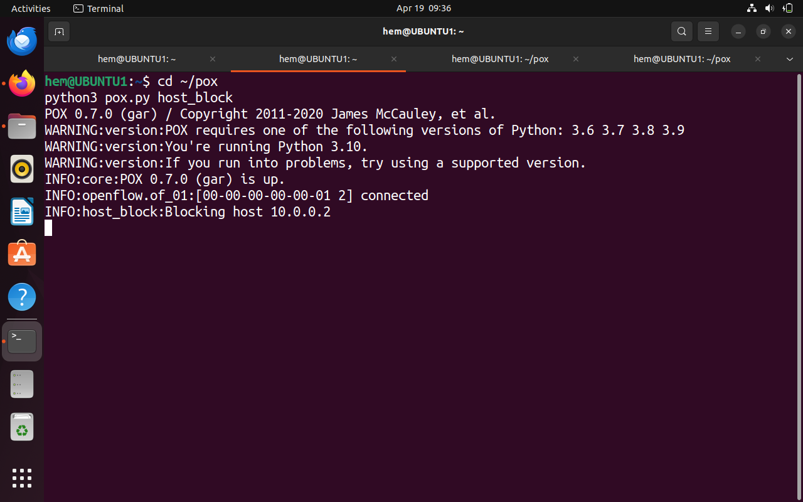
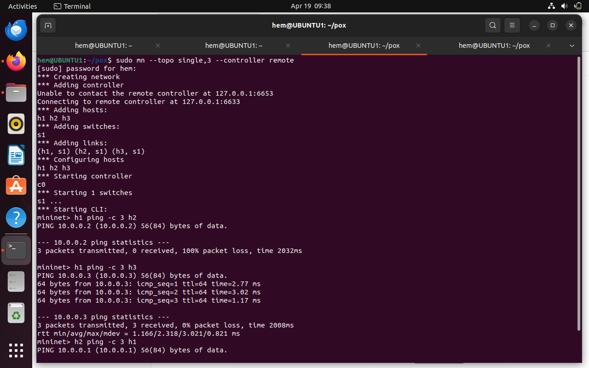
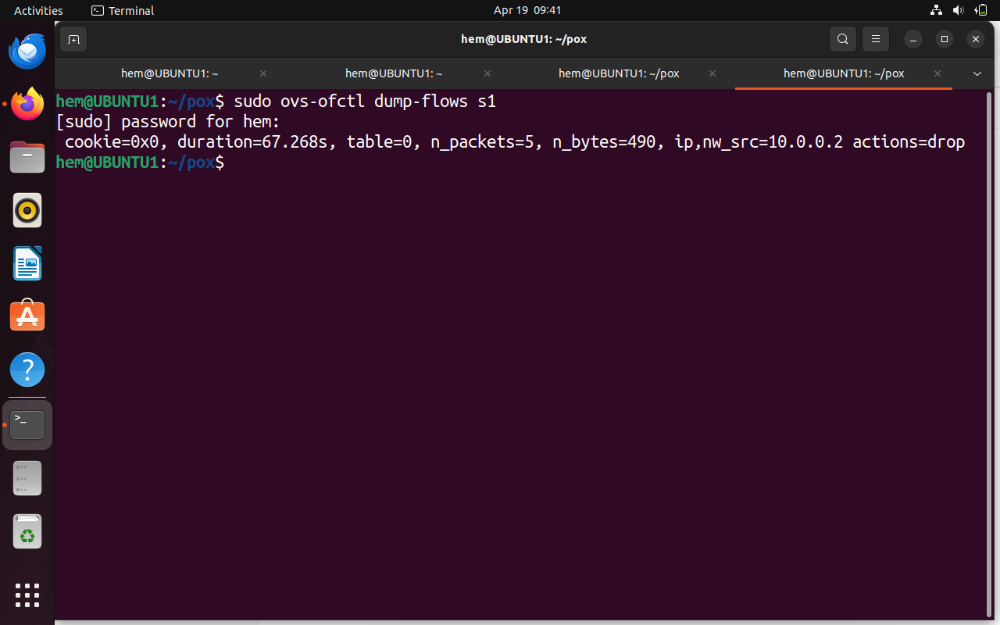

# Dynamic Host Blocking System using SDN

## 1. Problem Statement

In modern networks, malicious or suspicious hosts can disrupt communication by generating unwanted traffic. Traditional networks lack dynamic control to handle such threats.

This project implements a **Software Defined Networking (SDN)** solution to dynamically detect and block a suspicious host by installing flow rules in real time using a controller.

---

## 2. Objective

* Implement an SDN-based network using Mininet
* Monitor traffic using a controller
* Identify and block a suspicious host
* Allow normal traffic without interruption

---

## 3. Tools & Technologies Used

* **Mininet** – Network emulator
* **POX Controller** – SDN controller
* **OpenFlow Protocol** – Switch-controller communication
* **Ubuntu Linux** – Development environment

---

## 4. Network Topology

* 3 Hosts: h1, h2, h3
* 1 Switch: s1
* 1 Controller (POX)

```
h1 ----\
        s1 ---- Controller
h2 ----/
h3 ----/
```

---

## 5. Working Principle

1. Switch sends a **PacketIn** message to the controller for unknown flows
2. Controller inspects packet details
3. If source IP = **10.0.0.2**, it is marked as suspicious
4. Controller installs a **flow rule with DROP action**
5. Switch blocks all future packets from that host
6. Other hosts continue normal communication

---

## 6. Controller Logic

* Uses `_handle_PacketIn()` event
* Implements **match–action flow rule**:

  * Match: Source IP (`10.0.0.2`)
  * Action: Drop
* Uses learning switch logic for normal forwarding

---

## 7. Steps to Run the Project

### Step 1: Start POX Controller

```
cd ~/pox
python3 pox.py host_block
```

---

### Step 2: Start Mininet

```
sudo mn --topo single,3 --controller remote
```

---

### Step 3: Test Network Behavior

#### Allowed Traffic

```
h1 ping -c 3 h3
```

Expected Output:

```
0% packet loss
```

---

#### Blocked Traffic

```
h2 ping -c 3 h1
```

Expected Output:

```
100% packet loss
```

---

## 8. Flow Table Verification

To verify installed flow rules:

```
sudo ovs-ofctl dump-flows s1
```

Expected Output:

```
nw_src=10.0.0.2 actions=drop
```

---

## 9. Results

* Normal traffic is successfully forwarded
* Suspicious host is blocked
* Flow rules dynamically installed
* Network behavior controlled by SDN controller

---

## 10. Proof of Execution

### Controller Output



### Ping Test (Allowed vs Blocked)



### Flow Table (Blocking Rule)



---

## 11. Conclusion

This project demonstrates how SDN enables centralized and dynamic control of network behavior.
By installing flow rules in the switch, the controller can enforce security policies and block malicious hosts effectively.

---

## 12. References

* https://mininet.org
* https://github.com/noxrepo/pox
* https://opennetworking.org
